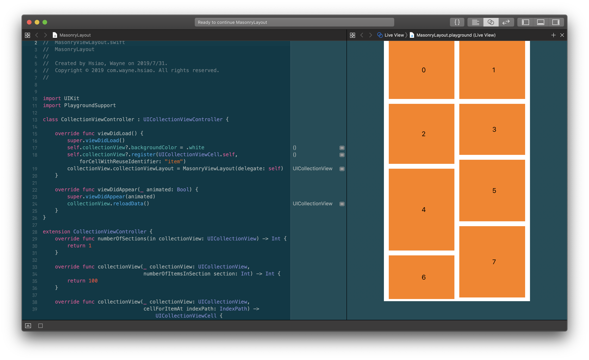
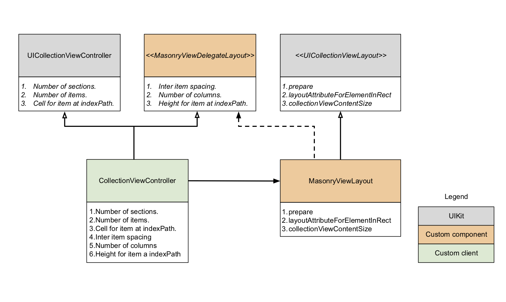
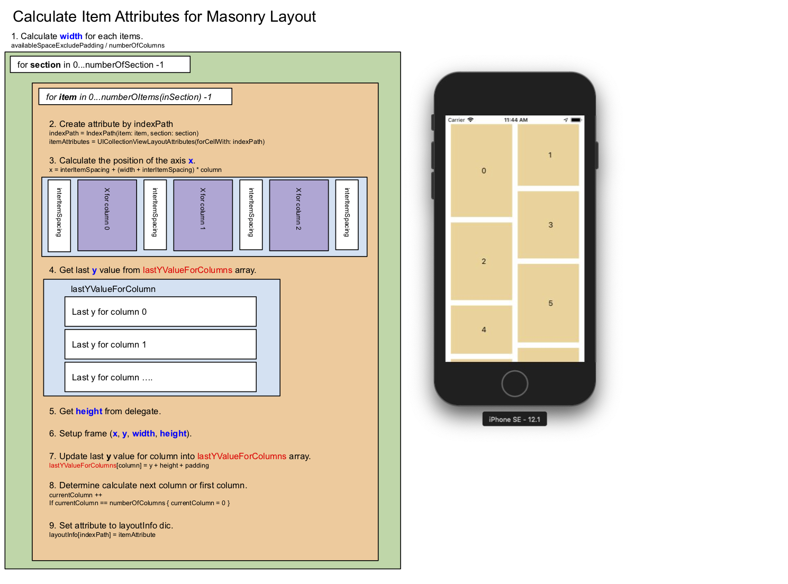

# MasonryViewLayout

## Demo

## Architecture

## Intro
The Masonry layout was famoused by [Pinterest](https://www.pinterest.com) and is now used by various sites. It is cool for accomedate different size of views in two-dimensional space.

This demo was inspired by [MasonryLayoutDemo](https://github.com/iosptl/ios7ptl/tree/master/ch05-CollectionViews/MasonryLayoutDemo) from awesome book [iOS 7 Programming Pushing Limits](https://www.amazon.com/iOS-Programming-Pushing-Limits-Applications/dp/1118818342). I made that in my point of view and the following is the explaination of how to implementation the Masonry Flow.

## MasonryViewLayout
The main part of masonry layout is the class MasonryViewLayout which inherited from UICollectionViewLayout. This class has two responsibilities. **1. Return the layout attributes for the items be rendered on the screen. 2. Return the content size of collection view.** The concept we are going to implement is calculated the frames for each items and we will save all calculated frames. It is easy to refer either the frames in a rect or the content size of collection view. The diagram below shows the concept of how to calculate the frame for each items.

[Wayne Hsiao](chronicqazxc@gmail.com), Aug 1, 2019
